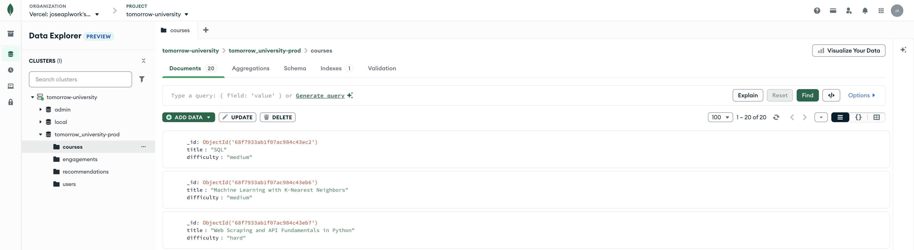
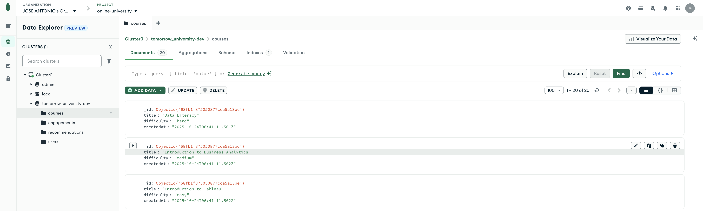

# Fullstack Engineer Take-Home Assignment - Implementation Report

## Overview
Complete implementation of all 5 tasks with production-ready enhancements. Transformed the basic challenge into a scalable, type-safe application with comprehensive testing and monitoring.

**Status**: ✅ All tasks completed + production improvements

---

## Setup & Evaluation Guide

### Testing & Quality
```bash
npm run test          # Unit tests
npm run test:e2e      # E2E tests
npm run lint          # Code quality check
npm run build         # Production build verification
```
---

## Task Implementation Summary

### Task 1: User Engagement Table ✅
**Challenge**: Display user names and course titles instead of ObjectIds

**Solution**: 
- MongoDB aggregation pipeline with `$lookup` joins in [`lib/data/queries.ts`](lib/data/queries.ts)
- Single query replaces N+1 pattern
- Type-safe with [`EngagementWithDetails`](models/index.ts) interface

### Task 2: Recommendation Effectiveness ✅
**Challenge**: Calculate recommendation system effectiveness

**Solution**:
- **Logic**: Recommendation is "used" when user engages with course AFTER recommendation timestamp
- **Metric**: `(Used Recommendations / Total Recommendations) × 100`
- **Implementation**: [`lib/business/recommendation-stats.ts`](lib/business/recommendation-stats.ts)

### Task 3: Course Performance Analysis ✅
**Challenge**: Identify top 3 and bottom 3 performing courses

**Solution**:
- **Metric**: `Total Engagements × Total Time Spent` (balances popularity + depth)
- **Implementation**: [`lib/business/course-performance.ts`](lib/business/course-performance.ts)
- **Dashboard**: Added performance tables in [`components/dashboard.tsx`](components/dashboard.tsx)

### Task 4: Production Readiness ✅
**Challenge**: Make the service production-ready

**Key Improvements**:
- **Environment**: [`env.ts`](env.ts) - Zod validation with fail-fast startup
- **Error Handling**: [`lib/api/errors.ts`](lib/api/errors.ts) + [`lib/api/helpers.ts`](lib/api/helpers.ts) - Standardized responses
- **Input Validation**: [`lib/api/validation.ts`](lib/api/validation.ts) - Zod schemas for API parameters
- **Security**: [`middleware.ts`](middleware.ts) - Security headers (HSTS, CSP, XSS protection)
- **Logging**: [`lib/shared/logger.ts`](lib/shared/logger.ts) - Structured logging with context
- **Database**: [`lib/data/connection.ts`](lib/data/connection.ts) - Connection pooling & error handling
- **Testing**: Comprehensive unit tests ([`tests/unit/`](tests/unit/)) and E2E tests ([`tests/e2e/`](tests/e2e/))

### Task 5: Deployment ✅
**Platform**: Vercel with MongoDB Atlas  
**Status**: ✅ Live at https://fullstack-data-engineer-tomorrow-univeristy-fl1u5jtdm.vercel.app/

Database cluster separation:


---

## Major Changes vs Original Codebase

### 🔧 Fixed Critical Issues
- **Route Parameter Bug**: Fixed [`app/api/engage/[userId]/[courseId]/route.ts`](app/api/engage/[userId]/[courseId]/route.ts) (was `[lessonId]`)
- **Error Handling**: Added try-catch blocks to all API routes
- **ObjectId Validation**: Added proper validation for route parameters
- **Database Connection**: Enhanced with connection pooling and timeout handling

### 🏗️ Architecture Improvements
**Original Structure**:
```
lib/ - Basic utilities and connection
components/ - Simple dashboard
```

**Enhanced Structure**:
```
lib/
├── api/           # Error handling, validation, helpers
├── business/      # Core business logic (recommendations, analytics)
├── data/          # Database connection, queries, seeding
└── shared/        # Utilities, logging, constants

components/        # Enhanced UI with error boundaries
tests/             # Comprehensive test suite
```

### 🆕 New Production Features
- **Environment Validation**: Type-safe environment with [`env.ts`](env.ts)
- **Security Headers**: [`middleware.ts`](middleware.ts) with HSTS, CSP, XSS protection
- **Structured Logging**: [`lib/shared/logger.ts`](lib/shared/logger.ts) with request tracking
- **Error Boundaries**: [`components/error-view.tsx`](components/error-view.tsx) for graceful failures
- **Testing Infrastructure**: [`vitest.config.ts`](vitest.config.ts) + [`playwright.config.ts`](playwright.config.ts)
- **Code Quality**: [`biome.json`](biome.json) for consistent formatting and linting

### 📊 Enhanced Dashboard Features
**Original**: Basic table with ObjectIds, simple recommendation count
**Enhanced**: 
- User names and course titles (Task 1)
- Recommendation effectiveness metrics (Task 2)
- Top/bottom 3 performing courses (Task 3)
- Formatted timestamps and time display
- Responsive design with error handling
- Split main areas into different component for more friendly readable code
- Responsive dashboard for product managers on mobile devices

---

## Technology Stack Additions

| Category | Added Tools | Purpose |
|----------|-------------|---------|
| **Testing** | Vitest, Playwright | Unit and E2E testing |
| **Code Quality** | Biome | Fast linting and formatting |
| **Validation** | Enhanced Zod schemas | Runtime type safety |
| **Development** | Scripts, VSCode config | Developer experience |
| **Deployment** | Vercel configuration | Production deployment |

---

## Nice-to-Have Improvements

### Backend Enhancements
- [ ] API documentation (OpenAPI)
- [ ] Error tracking service (Sentry)
- [ ] Background job processing
- [ ] Data transfer object definition for API layer
- [ ] Database indexes and caching layer
- [ ] Rate limiting and health checks
- [ ] CORS for security purposes
- [ ] Authentication and authorization system
- [ ] Testing more critical functionality of the codebase like API error responses


### Frontend Enhancements  
- [ ] Data visualization charts
- [ ] Advanced filtering and pagination
- [ ] Export features (CSV/PDF)
